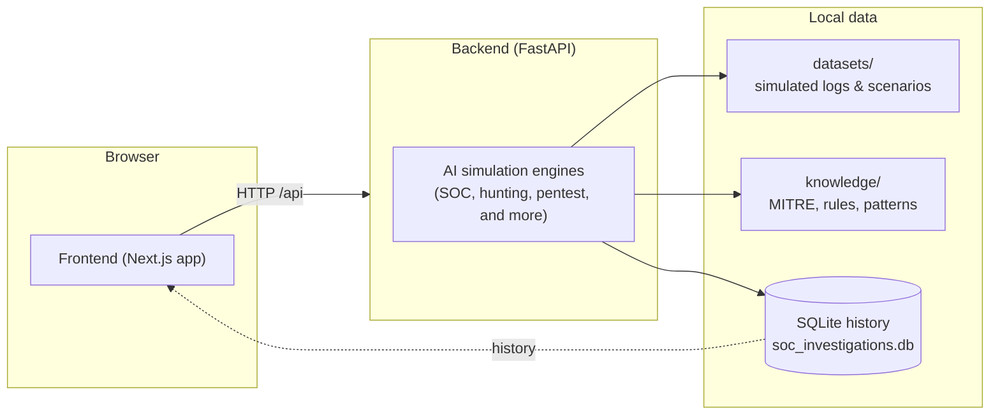
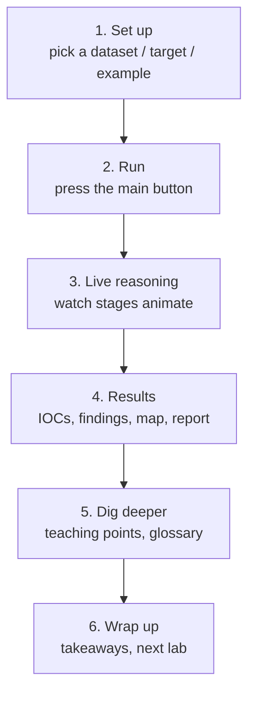
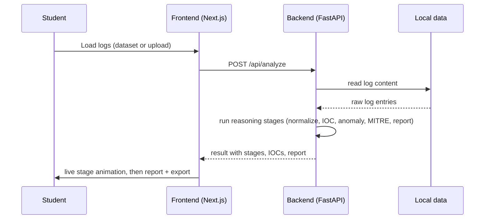
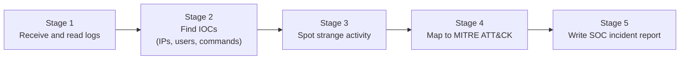
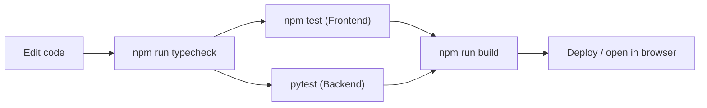

# AI Cybersecurity Playground

An interactive learning platform for students. It shows how artificial intelligence helps **defend** computer systems, and also how AI systems can be **attacked** and **secured**.

Students work inside a simulated security command center. They run "live" investigations powered by simulated AI analysis, and follow the exact workflow of an AI-assisted security analyst, threat hunter, penetration tester, or security engineer. Every step includes teaching notes.

> **This is only a sandbox for learning.** Every dataset, target, finding, and scenario is **simulated**. The app never connects to, attacks, or tests real systems, real people, or real APIs. It teaches concepts. It does not probe production environments.


---

## Table of Contents

- [What this app teaches](#what-this-app-teaches)
- [Modules](#modules)
- [Learning Hub and Learning Paths](#learning-hub-and-learning-paths)
- [How it works (diagram)](#how-it-works)
- [Tech stack](#tech-stack)
- [Folder layout](#folder-layout)
- [What you need first](#what-you-need-first)
- [Install and Run on macOS](#install-and-run-on-macos)
- [Install and Run on Windows](#install-and-run-on-windows)
- [Install and Run on Linux](#install-and-run-on-linux)
- [How the frontend finds the backend](#how-the-frontend-finds-the-backend)
- [How to use the app](#how-to-use-the-app)
- [Running tests](#running-tests)
- [Production build](#production-build)
- [Datasets and knowledge base](#datasets-and-knowledge-base)
- [Troubleshooting](#troubleshooting)
- [Further reading](#further-reading)

---

## What this app teaches

The app is built around one simple idea. **AI changes cybersecurity in two directions.**

1. **Defend with AI.** AI helps with detection, triage, threat hunting, pentest planning, malware analysis, code review, and privacy scanning. A human analyst always stays responsible for the final decision.
2. **Secure AI.** The same AI can be tricked: prompt injection, jailbreaks, adversarial examples, agent abuse, unsafe code, and AI mistakes (hallucination, overconfidence, automation bias).

Each module answers **one clear question**, shows information step by step, and explains not just *what* happened, but *why* it happened, and **what to try next**.

### What makes it good for a classroom

- **Instructor Mode.** A switch in the top bar shows teaching points, "the catch", and "dig deeper" notes in every module.
- **Learning Hub.** Pick a learning path, read short theory lessons with animated flow diagrams, and jump straight into any lab.
- **Live AI pipelines.** Every module animates the AI steps while it "runs". Students see the process, not just the result.
- **Interactive effects.** Holographic panels, cursor-following spotlights, hover-tilt cards, data-flow links, text reveal effects, and live status dots. All effects turn off automatically for users who prefer less motion.
- **Built-in checks.** The project ships with type checking, 167 frontend tests, and a backend API test suite.

---

## Modules

The app has 12 interactive lab modules plus a Learning Hub. Each module has its own README that explains its method and goals. See [Further reading](#further-reading).

### Module list

| # | Module | Question it answers |
|---|--------|---------------------|
| 0 | **Learning Hub** | "What should I learn first?" |
| 1 | **AI SOC Analyst** | "What happened in my security logs?" |
| 2 | **AI Threat Hunting** | "What threat am I looking for?" |
| 3 | **AI Pentest Assistant** | "How should I test this target?" |
| 4 | **Prompt Injection Lab** | "Can this AI app be tricked by text?" |
| 5 | **Jailbreak Playground** | "How strong is this model's safety?" |
| 6 | **Adversarial ML Lab** | "Can this AI model be fooled?" |
| 7 | **AI Agent Security** | "Can this AI agent act safely?" |
| 8 | **AI Malware Analyst** | "What is this malware doing?" |
| 9 | **AI Security Code Reviewer** | "Is this code safe to ship?" |
| 10 | **AI Data Privacy Lab** | "Does this data leak secrets?" |
| 11 | **AI Risk and Governance Simulator** | "Should this AI system be launched?" |
| 13 | **AI Failure Lab** | "Can I trust the AI output?" |

### About each module

- **1 - AI SOC Analyst.** Feed raw Windows, PowerShell, or web logs to the AI. Watch a 5-step reasoning flow: read normal data, find Indicators of Compromise (IOCs), find strange activity, match MITRE ATT&CK methods, then write a full incident report with a defense plan. You can also upload your own logs.
- **2 - AI Threat Hunting.** Turn a hunting goal into a clear guess (a hypothesis). Choose the right log sources. Get detection queries in Sigma, KQL, Splunk, and SQL. Review findings and confidence at the end.
- **3 - AI Pentest Assistant.** Set up a target (web server, login, database, API). Watch the AI work through steps: recon, login tests, input tests, permission tests, and reporting. Map the attack surface and ask the assistant questions.
- **4 - Prompt Injection.** Attack a simulated AI chat app by hiding instructions inside normal text. Compare a weak vs. protected version side by side.
- **5 - Jailbreak Playground.** Try to trick a safety-trained model using roleplay, code tricks, and social tricks. Measure how many attempts get through, and learn why barriers held or broke.
- **6 - Adversarial Face Lab.** Create tiny changes (noise, retake, rotate) that flip a face model answer, then harden the model and test it again. Uses fake people only.
- **7 - AI Agent Security.** Run an AI agent through a full loop (goal, plan, memory, tool call, result, decision). Attack it with hidden instructions, bad memory, and too much power. Defend it with rules, allowlists, and least privilege.
- **8 - AI Malware Analyst.** Study fake malware samples (PowerShell, ransomware, remote access, password stealing). Map behaviors to MITRE. Get Yara, Sigma, and Suricata rules. Read a risk report.
- **9 - AI Security Code Reviewer.** Review weak vs. fixed code in Python, JS, Java, C++, Go, C#, PHP, and Rust. See the security score before and after, and the exact code fix.
- **10 - AI Data Privacy Lab.** Find sensitive data (names, emails, passwords, health, credit card data). Score the risk, remove the risk info, and check prompts against policy before sending.
- **11 - AI Risk and Governance Simulator.** Test an AI application against a risk list, apply governance controls, and get a final risk score with a GO or NO-GO decision.
- **13 - AI Failure Lab.** Learn when AI is wrong: missed attacks, made-up facts, too much confidence, and bot bias. Train your judgment with challenges and scorecards.

---

## Learning Hub and Learning Paths

The Learning Hub is the front door of the app. It does three things:

1. **Choose a learning path.** Pick "AI for cybersecurity" or "Cybersecurity of AI". The suggested lab order changes to match your path.
2. **Theory library.** 11 short lessons: AI, Machine Learning, LLMs, RAG, Prompt Injection, Adversarial Examples, AI Agents, AI Detection and SOC, Threat Hunting, AI-Assisted Penetration Testing, Jailbreaks. Each has a short intro, "the catch", an animated flow diagram, full teaching text, and key takeaways.
3. **Lab grid.** All labs as cards with difficulty level, time, skills, and "what you will learn".

You can open any lab at any time. Nothing is locked.

---

## How it works (diagram)

### System overview



### How a lab run flows



### The AI SOC Analyst pipeline



**Quick explanation of the 5-stage SOC pipeline:**



---

## Tech stack and architecture

| Layer | What it uses |
|-------|-----------|
| **Frontend** | Next.js 14, React 18, TypeScript, Tailwind CSS, Lucide icons, Vitest. |
| **Backend** | Python FastAPI and Uvicorn, with simulated analysis engines. |
| **Storage** | SQLite file (`soc_investigations.db`) for review history. |
| **Design system** | Custom "Cyber Command" design rules in `DESIGN_RULES.md`. |
| **Data** | Packaged fake datasets and a knowledge base (MITRE, rules, patterns). |

Both layers are independent simulation engines. The **backend** runs the AI analysis work. The **frontend** also has built-in demo data, so most screens keep working if the API is temporarily down.

---

## Folder layout

```
ai-cybersecurity-playground/
├── README.md                      # this file
├── README_*.md                    # one README per module
├── DESIGN_RULES.md                # design system rules
│
├── backend/
│   ├── main.py                    # FastAPI app and all routes
│   ├── requirements.txt
│   ├── pytest.ini
│   ├── app/
│   │   ├── database.py            # SQLite setup and history
│   │   └── services/              # 12 AI simulation engines
│   └── tests/                     # pytest API tests
│
├── frontend/
│   ├── package.json
│   └── src/
│       ├── app/                   # Next.js app router (page.tsx)
│       ├── components/            # React UI code per module
│       ├── services/              # API clients + demo fallback
│       └── data/                  # datasets, lab briefs, code files
│
├── datasets/                      # simulated attack data + scenarios
└── knowledge/                     # MITRE, detection rules, patterns
```

---

## What you need first

- **Node.js v18+** and **npm** (for the frontend).
- **Python 3.9+** and **pip** (for the backend).
- Internet is only needed the first install. The app is local.

> On some Linux systems use `python3` and `pip3`, and install the `python3-venv` package. On Windows use **PowerShell** and make sure Python and Node are on `PATH`.

Check the versions before you start:

```bash
# frontend
node --version   # v18 or newer
npm --version

# backend
python --version   # macOS/Linux may need: python3 --version
pip --version      # may be: pip3 --version
```

---

## Install and Run on macOS

### 1. Start the backend

```bash
cd ai-cybersecurity-playground/backend

python3 -m venv venv
source venv/bin/activate

pip install -r requirements.txt

python main.py      # or: python3 main.py
```

You should see FastAPI start, with a line like:
`Uvicorn running on http://0.0.0.0:8000`.

### 2. Start the frontend (in a second terminal)

```bash
cd ai-cybersecurity-playground/frontend

npm install
npm run dev
```

Open **http://localhost:3000** in your browser.

> Tip: To stop the backend later, press `Ctrl+C` in the backend terminal.

---

## Install and Run on Windows

The commands below use **PowerShell**.

### 1. Start the backend

```powershell
cd ai-cybersecurity-playground\backend

python -m venv venv
.\venv\Scripts\Activate.ps1   # if it blocks, first run:
                              # Set-ExecutionPolicy -Scope CurrentUser RemoteSigned

pip install -r requirements.txt

python main.py
```

If `python` is not recognized, use the Python launcher:

```powershell
py -m venv venv
.\venv\Scripts\Activate.ps1
py -m pip install -r requirements.txt
py main.py
```

### 2. Start the frontend (PowerShell, second window)

```powershell
cd ai-cybersecurity-playground\frontend

npm install
npm run dev
```

Open **http://localhost:3000**.

> If the browser alerts about CORS, see [Troubleshooting](#troubleshooting).

---

## Install and Run on Linux

(Written for Debian, Ubuntu, and Fedora. Other distros work the same.)

### 1. Start the backend

```bash
cd ai-cybersecurity-playground/backend

python3 -m venv venv
source venv/bin/activate

pip install -r requirements.txt   # or: python3 -m pip install ...

python main.py                     # or: python3 main.py
```

If the `venv` package is missing:

```bash
# Debian / Ubuntu
sudo apt update && sudo apt install -y python3-venv python3-pip

# Fedora
sudo dnf install -y python3-devel python3-pip
```

### 2. Start the frontend

```bash
cd ai-cybersecurity-playground/frontend

npm install
npm run dev
```

Open **http://localhost:3000**.

---

## How the frontend finds the backend

Every API client reads the base address from a config value (`NEXT_PUBLIC_API_URL`). If it is not set, the app uses `http://localhost:8000/api`.

- **Same machine (default).** Nothing to change. Both apps run on your own computer.
- **Different machine or server.** Set the address before starting the frontend:

```bash
# macOS / Linux
NEXT_PUBLIC_API_URL=http://192.168.1.50:8000/api npm run dev

# Windows (PowerShell)
$env:NEXT_PUBLIC_API_URL = "http://192.168.1.50:8000/api"
npm run dev
```

Check that the API is alive:

```bash
curl http://localhost:8000/api/health
# {"status":"online","service":...,"database":"connected"}
```

> The frontend has demo data for each module. If the API is offline, most screens still open with local data. Look for the console message "Backend API offline, using local data". For the full experience, run the backend.

---

## How to use the app

### 1. First run

1. Open **http://localhost:3000**.
2. In the **Learning Hub**, choose a **learning path**:
   - *AI for Cybersecurity* starts with SOC Analyst, Threat Hunting, and Pentest.
   - *Cybersecurity of AI* starts with Prompt Injection, Jailbreak, Adversarial, and Agent Security.
   - You can switch or open any lab anytime from the left menu.
3. Read the short concept lesson to understand the topic, then press **Open lab**.

### 2. The standard flow for any lab

Every module uses the same steps (see the diagram above):

1. **Set up.** Pick a dataset, target, example, or scenario.
2. **Run.** Press the main button (Start, Analyze, Hunt, Evaluate). Watch the AI reasoning animate.
3. **Review.** Check the results: IOCs, MITRE map, findings, report.
4. **Dig deeper.** Try the glossary ("?") buttons and keep **Instructor Mode** on to read the teaching material.
5. **Export or continue.** Download a JSON/Markdown report, then continue to a mission report.

### 3. A quick 60-second demo

1. Open **AI SOC Analyst**.
2. Click **Load Sample Dataset** (Brute Force, PowerShell, or Malware).
3. Click **Analyze Logs**. Watch the 5-stage pipeline run.
4. At the end, scroll to the **SOC Incident Report** and export it as JSON or Markdown.

### 4. Reset progress

In the **Learning Hub**, use **Reset progress** (top-right) to clear all lab history and start fresh.

---

## Running tests

### Backend tests (pytest)

```bash
cd backend
source venv/bin/activate        # Windows: .\venv\Scripts\Activate.ps1
pytest
```

### Frontend checks

```bash
cd frontend

npm run typecheck        # TypeScript type checks
npm test                 # Vitest (167 tests)
```

### Full test flow (diagram)



---

## Production build

### Frontend

```bash
cd frontend
npm run build     # Next.js production build
npm start         # serve the built site on :3000
```

### Backend

```bash
cd backend && source venv/bin/activate && pip install -r requirements.txt
uvicorn main:app --host 0.0.0.0 --port 8000
```

---

## Datasets and knowledge base

- **`datasets/`** - Fake log files (`bruteforce.json`, `powershell_attack.json`, `malware_execution.json`) and per-module scenario folders (adversarial-ml, agent-security, ai-failures, code-review, governance, jailbreak, malware-analysis, pentest, privacy, prompt-injection, threat-hunting).
- **`knowledge/`** - Base data used by the engines: `mitre_attack.json`, `detection_rules.json`, `security_patterns.json`, and per-module lesson data.
- **SQLite** - The backend saves recent work (investigations, malware reports, code reviews, privacy scans, governance reviews, AI-failure reviews) in `soc_investigations.db`. It is created automatically on the start. Delete the file to clear the history.

---

## Troubleshooting

| Problem | Likely fix |
|---------|-----------|
| `command not found: python` (macOS/Linux) | Use `python3` instead, or install Python 3.12. |
| `python` not recognized (Windows) | Install Python from python.org and tick "Add python to PATH". Then use `py main.py`. |
| `venv` missing (Linux) | `sudo apt install python3-venv` (see Linux section). |
| Frontend cannot reach API | Start the backend. Check `curl http://localhost:8000/api/health`. Re-start the frontend after editing `NEXT_PUBLIC_API_URL`. |
| Port 8000 already in use | Kill the old process, or run `uvicorn main:app --port 8001` and point the frontend at it. |
| Weird app install state | Delete `node_modules` and `package-lock.json`, then `npm install` again. |
| Animations not showing | The browser "reduce motion" setting turns effects off by design. |
| Database history issues | Delete `backend/soc_investigations.db` and restart the backend. |

---

## Further reading

- Module 1 - [AI SOC Analyst](README.md) (this file)
- Module 2 - [AI Threat Hunting](README_THREAT_HUNTING.md)
- Module 3 - [AI Pentest Assistant](README_PENTEST_ASSISTANT.md)
- Module 4 - [Prompt Injection](README_PROMPT_INJECTION.md)
- Module 5 - [Jailbreak Playground](README_JAILBREAK_PLAYGROUND.md)
- Module 6 - [Adversarial ML Lab](README_ADVERSARIAL_ML_LAB.md)
- Module 7 - [AI Agent Security](README_AGENT_SECURITY.md)
- Module 8 - [AI Malware Analyst](README_MALWARE_ANALYST.md)
- Module 9 - [AI Security Code Reviewer](README_SECURITY_CODE_REVIEWER.md)
- Module 10 - [AI Data Privacy Lab](README_DATA_PRIVACY_LAB.md)
- Module 11 - [AI Risk and Governance Simulator](README_AI_GOVERNANCE_SIMULATOR.md)
- Module 13 - [AI Failure Lab](README_AI_FAILURE_LAB.md)

The design that governs every screen is in [`DESIGN_RULES.md`](DESIGN_RULES.md).

---

*Built for students learning how AI helps, and how AI can break, cybersecurity.*