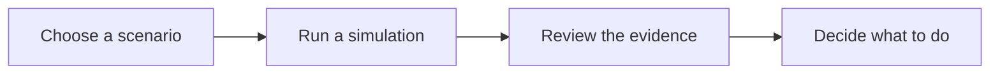
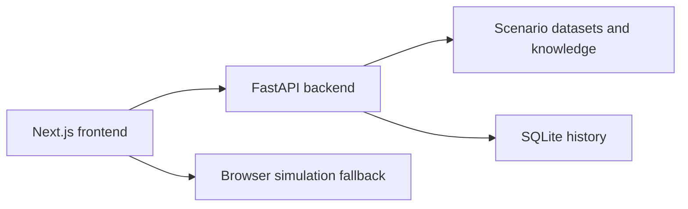

# AI Security

Practice AI cybersecurity through 12 guided labs. Investigate threats with AI, test how AI systems fail, and learn how to protect them. All targets, models, and findings are simulated.

[Open the playground](https://ai-cybersecurity-playground.projects.recepbalibey.com/)


## What you can practice

| Defend with AI | Secure AI systems |
| --- | --- |
| Log analysis and threat hunting | Prompt injection and model safety |
| Security assessments and malware analysis | Adversarial ML and agent permissions |
| Code review and checking AI claims | Data privacy and AI governance |

The Learning Hub includes short theory lessons, two learning paths, and saved progress. Labs include teaching notes, evidence, and reports.

## How it works


```mermaid
flowchart LR
    A[Choose a scenario] --> B[Run a simulation]
    B --> C[Review the evidence]
    C --> D[Decide what to do]
```


```mermaid
flowchart LR
    UI[Next.js frontend] --> API[FastAPI backend]
    API --> Data[Scenario datasets and knowledge]
    API --> DB[SQLite history]
    UI --> Local[Browser simulation fallback]
```

## Run locally

Use Node.js 20+ and Python 3.9+. Run these commands from the repository root in two terminals.

**Backend**

```bash
cd backend
python3 -m venv .venv
source .venv/bin/activate
pip install -r requirements.txt
uvicorn main:app --host 127.0.0.1 --port 8000
```

On Windows, use `python` and `.venv\Scripts\Activate.ps1` instead.

**Frontend**

```bash
cd frontend
npm ci
npm run dev
```

Open [localhost:3000](http://localhost:3000). The default API is `http://localhost:8000/api`. Set `NEXT_PUBLIC_API_URL` before building when using another backend.

## Project layout

```text
frontend/       Next.js interface, tests, and public logo
backend/        FastAPI services and API tests
datasets/       Simulated scenarios
knowledge/      Learning and detection data
docs/           Lab guides, design rules, and demo media
Dockerfile      Backend container
railway.toml    Railway deployment settings
```

## Check and build

```bash
npm run typecheck --prefix frontend
npm test --prefix frontend
npm run build --prefix frontend
```

For backend tests, activate its virtual environment and run `pytest` inside `backend/`.

The frontend exports to `frontend/out` for Cloudflare Pages. The backend runs on Railway. Both use the existing GitHub deployment integrations.

[Development guide](docs/development.md) · [Lab guides](docs/labs/) · [Design rules](docs/design.md)
